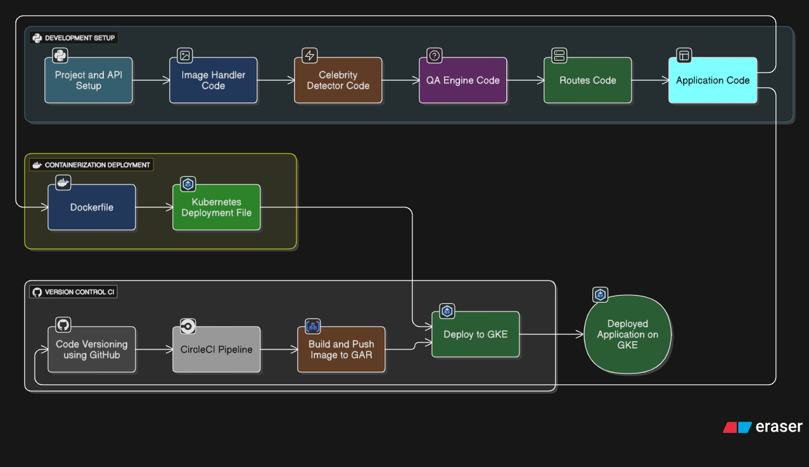

# Celebrity Detector and Q&A

Welcome to the **Celebrity Detector and Q&A** project! This repository contains a complete, end-to-end web application that leverages computer vision and generative AI to detect celebrities from images and answer context-aware questions about them using Google's Gemini 2.5 Flash model. 

## 🚀 Project Overview

The Celebrity Detector and Q&A app is designed to provide a seamless interactive experience. Users can upload an image of a celebrity, and the system will intelligently detect who it is. Once the celebrity is identified, users can ask questions about them, and the application will use state-of-the-art Large Language Models (LLMs) to provide accurate, context-aware answers.

This project is built with scalability and automation in mind, featuring a robust MLOps/LLMOps pipeline with Docker, Kubernetes, Google Cloud Platform (GCP), and CircleCI.

## 🏗️ Architecture & Workflow



### 🔄 Workflow

1. **Image Input:** The user uploads an image of a celebrity via the web interface.
2. **Detection Phase:** The application uses computer vision capabilities (OpenCV/custom models) to analyze the image and identify the celebrity.
3. **Question & Answer (Q&A):** The user submits a question about the identified celebrity.
4. **LLM Integration:** The backend sends a request to the **Gemini 2.5 Flash** API via the Google GenAI library, establishing context about the celebrity.
5. **Response Delivery:** The model's response is retrieved and presented to the user on the web interface.
6. **Deployment & CI/CD:** Every push to the repository triggers a CircleCI pipeline that builds a new Docker image, pushes it to GCP Artifact Registry, and updates the deployment on a Google Kubernetes Engine (GKE) cluster.

## 🛠️ Tech Stack

This project utilizes a modern technology stack across the frontend, backend, and infrastructure:

- **Programming Language:** Python 3.14
- **Web Framework:** Flask
- **Generative AI:** Google GenAI API (Gemini 2.5 Flash model)
- **Computer Vision & Image Processing:** OpenCV, Pillow, Numpy
- **Containerization:** Docker
- **Orchestration:** Kubernetes (GKE)
- **Cloud Provider:** Google Cloud Platform (GCP)
- **CI/CD:** CircleCI

## 📂 Project Structure

```
CELEBRITY-DETECTOR-AND-Q-A-/
├── .circleci/                 # CircleCI configuration for automated CI/CD pipelines
├── app/                       # Core application logic, utilities, and integrations
├── Architecture/              # Architecture diagrams and design assets
├── Inputs/                    # Sample or test input files
├── Outputs/                   # System generated outputs
├── static/                    # Static web assets (CSS, JS, images)
├── templates/                 # HTML templates for the Flask application
├── Dockerfile                 # Instructions to containerize the Flask application
├── FULL_DOCUMENTATION.md      # Detailed documentation for Cloud & K8s deployment
├── kubernetes-deployment.yaml # Kubernetes manifests for workload deployment
├── requirements.txt           # Python package dependencies
├── setup.py                   # Setup script for the Python package
└── app.py                     # Main Flask application entry point
```

## ⚙️ Getting Started (Local Setup)

To run this project locally, follow these steps:

### 1. Clone the Repository

```bash
git clone https://github.com/pamuarun/CELEBRITY-DETECTOR-AND-Q-A-.git
cd CELEBRITY-DETECTOR-AND-Q-A-
```

### 2. Set Up a Virtual Environment (Recommended)

Ensure you are using **Python 3.14** as specified in the tech stack.

```bash
python -m venv venv
source venv/bin/activate  # On Windows use `venv\Scripts\activate`
```

### 3. Install Dependencies

Install the required packages using the `requirements.txt` file or `setup.py`:

```bash
pip install -r requirements.txt
```

### 4. Configure Environment Variables

Create a `.env` file in the root directory and add your Gemini API Key:

```env
GEMINI_API_KEY="your_gemini_api_key_here"
```

### 5. Run the Application

Start the Flask development server:

```bash
python app.py
```

The application will be accessible at `http://localhost:5000` (or `http://0.0.0.0:5000`).

## ☁️ Cloud Deployment & LLMOps Configuration

> **IMPORTANT:** For complete, step-by-step instructions on setting up the cloud infrastructure, please refer to the **[`FULL_DOCUMENTATION.md`](FULL_DOCUMENTATION.md)** file included in this repository.

The `FULL_DOCUMENTATION.md` file contains detailed procedures for:
- Enabling necessary GCP APIs (GKE, Artifact Registry, Cloud Build, etc.).
- Creating a Google Kubernetes Engine (GKE) Cluster.
- Setting up a GCP Service Account and base64-encoding the `gcp-key.json`.
- Configuring CircleCI for continuous deployment and setting environment variables.
- Securing your `GEMINI_API_KEY` inside the Kubernetes cluster using `kubectl` secrets.

## 🤝 Contributing

Contributions, issues, and feature requests are welcome! Feel free to check out the [issues page](https://github.com/pamuarun/CELEBRITY-DETECTOR-AND-Q-A-/issues) if you want to contribute.
